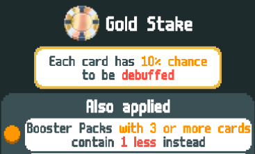
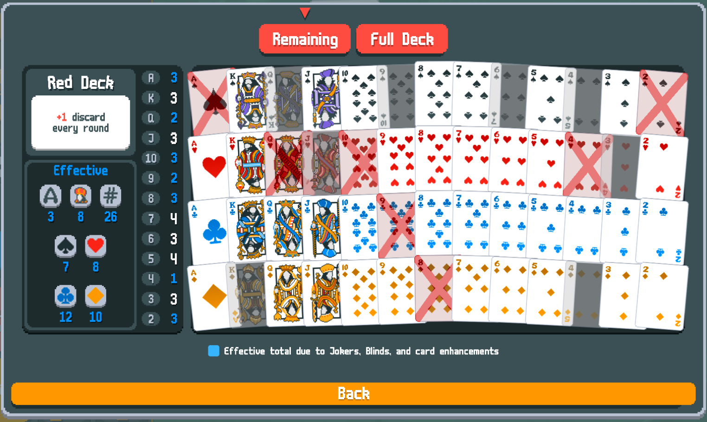

# Better Stakes
A mod for balatro that changes orange and gold stakes, making them easier and reducing the need to reset for a good start.

Requires [Steamodded](https://github.com/Steamopollys/Steamodded).

# Changes

- **Orange stake**: booster packs keep their base cost instead of scaling with ante, however each booster that has 3 or more cards contains one less instead.
- **Gold stake**: hand size stays the same, but each card has 10% chance to be debuffed.

Cards get rolled for a debuff at the beginning of round, meaning you can get a look at your deck and plan around the debuffs. If you use Arcana cards to transform your playing cards during the round, the transformed card will keep its previous state. Some examples: 

- Transforming a debuffed card with Tower will produce a debuffed stone card.
- Using Death to transform a non-debuffed card into a debuffed one will produce a non-debuffed copy.

# Reasoning
What I've always found fun in rougelikes is fighting your way to victory with whatever the RNG Gods throw at you. However, these last two stakes severely reduce your ability to craft your deck, with booster packs becoming crazy expensive, and to make more powerful combinations, with the reduced hand size.

This often leads to resetting a run for a good joker start, eventually trying to win with high card or pairs, which I didn't find particular enjoyable. I tried to change the stakes in a way that the intent of the malus stays the same, without being completely unfair.

# Screenshots

# Changelog
- Changed debuff chance from 25% to 10%.