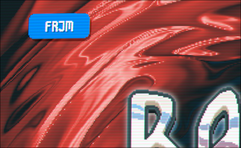
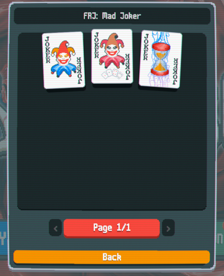
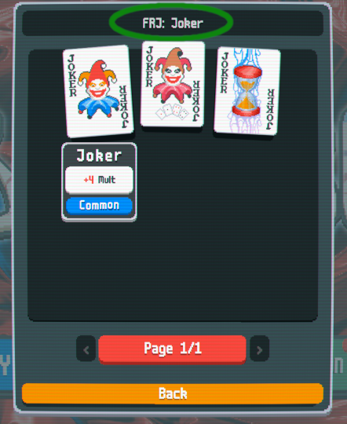
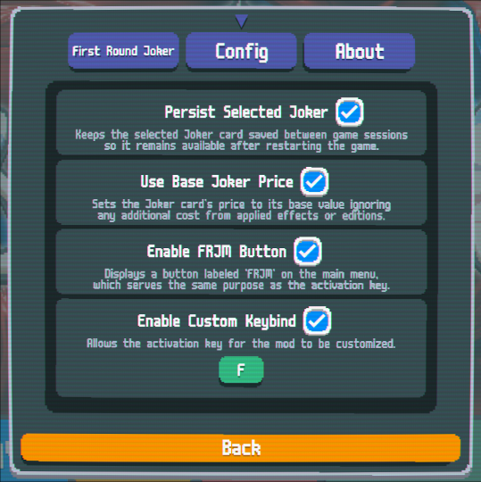
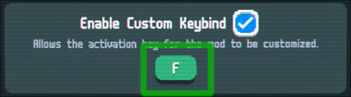
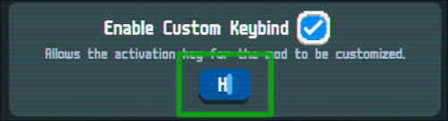

# first-round-joker

This is a simple [Balatro](https://store.steampowered.com/app/2379780) mod
that ensures a specific Joker card appears in the shop during the first round.

> :warning: If you're using mod version `1.x.x`, please update to the latest `v2.x.x` version. This version includes new features and major improvements.
> For update instructions, refer to the [README](../README.md).

## Features

- **Easy Installation**: The mod uses `smods` which makes the mod install and uninstall easier.

- **Easy Integration:** The mod seamlessly integrates with the game's UI and mechanics.

- **Custom Keybind Support:** Change the **activation key** to suit your preferences.

- **Support for Steam Deck and handheld devices**: Provided through the **FRJM** button, enabled by default.

## Installation

See the project's [README](../README.md).

## Usage

The mod does not select any card by default.
~~It only allows you to select **discovered** Jokers.~~
(This restriction can be disabled in the mod *source* code. See `config.lua`).
A discovered Joker is one that you have purchased at least once, you can check your discovered Jokers on **COLLECTION** -> **Jokers**.

> **Note**: These usage instructions apply only to mod version `v2.x.x` or later.

### Joker selection

To start using the mod, you need to select a Joker card first, follow these steps to
select your desired Joker card:

1. Press the **activation key** (**F** by default) or click the FRJM button in the
top-left corner of the main menu (see **Figure 1**):

    
    *Figure 1: FRJM button*

2. This action will open the **selection overlay**, allowing you to choose a
Joker card (see **Figure 2**):

    
    *Figure 2: Selection overlay*

3. In the **selection overlay**, choose your preferred card by **clicking** on it.
The name of the selected card will appear at the top:

   
   *Figure 3: Joker card selection*

4. Once you have selected your favorite Joker, close the overlay by clicking
the **Back** button or pressing the **Escape** (ESC) key.

The selected card will appear in the first round shop with a "**Negative**" edition modifier.
If the card price is too high, you can enable the **Use Base Joker Price** option
in the configuration tab. You can change the selected Joker at any time by pressing
the **activation key** again or by clicking the **FRJM** button (if enabled).

> **Note:** The **Joker selection** process is required every time you open or restart the
> game unless you enable the **Persist Selected Joker** option.
> See [Configuration](#configuration) for more details.

## Configuration

You can access the mod configuration through the **smods** mod manager panel, you can
access it by clicking the **MODS** button on the main menu.

*Figure 4: FRJM configuration tab*

The mod provides the following configuration options:

> You can see the detailed option description in the mod configuration tab.

- **Persist Selected Joker**: Enables the Joker card save feature. This is disabled by default.

- **Use Base Joker Price**: Reduces the Joker card price. This is disabled by default.

- **Enable FRJM Button**: If enabled, adds a button to the main menu screen that functions as the **activation key** when clicked.

- **Disable Joker Restriction**: Allow selecting Undiscovered and Locked Jokers.

- **Enable Custom Keybind**: Allows using a custom **activation key**.
See [Activation key](#activation-key) for more details. This is disabled by default.

- **Activation Key**: Specifies a custom **activation key**. The default is **F**. Changing this requires a restart.

### Activation key

The **activation key** is the keyboard key used to open the Joker card
selection overlay. This overlay allows you to choose the Joker card that will
appear in the first round shop.

You can see the current **activation key** on the mod's configuration tab, as shown
in the **Figure 5** below.

*Figure 5: Activation key option*

To change the **activation key**, follow these steps:

1. On the mod configuration tab, search for the **Enable Custom Keybind** option and
enable it (see **Figure 5**).

2. Click the **green text input** where the current **activation key** is displayed (see **Figure 5**).

3. The text input will turn **blue**, allowing you to delete the existing key and type
the new **activation key** (see **Figure 6**). Press the **Enter** key to save the changes.

    
    *Figure 6: Change activation key*

~~- **Optional**: Click the **Restart Game** button to restart the game so that the changes
take effect.~~ No longer required.

## Troubleshooting

Please note that this mod does not make unnecessary modifications.
If you encounter issues unrelated to the shop, it is unlikely that this mod is the cause.

If you have multiple mods installed, verify the source of the issue by disabling
or uninstalling this mod. If the problem persists after doing so,
it is clear that the issue is not caused by this mod.

If the problem occurs when this mod is enabled alongside another mod,
please open a new issue requesting compatibility support. Be sure to
include the following information:

- **Game version**
- **smods version**
- **Mod name** (the mod requiring compatibility support, not this mod.)
- **Mod URL** (the mod's official homepage or git repository, if possible)

> Note: For the **Mod URL**, do not link directly to a release file. Instead, provide the mod's official homepage or the relevant post link on Discord.
