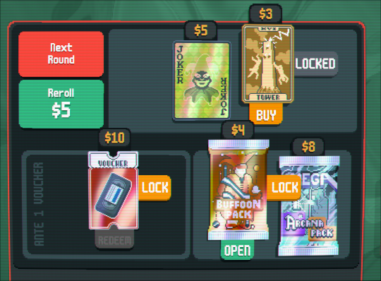
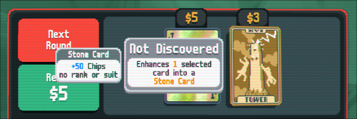
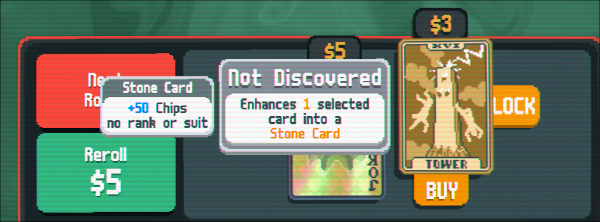
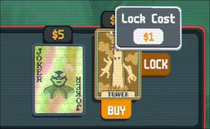
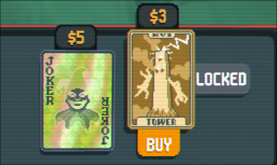
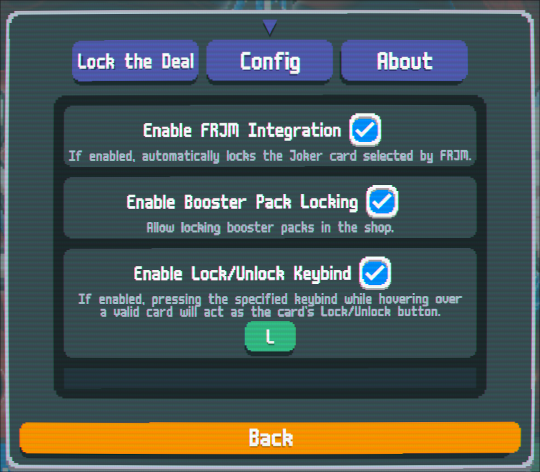
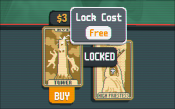
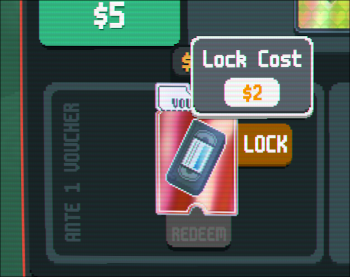

# Lock the Deal

Tired of missing out on must-have cards like Jokers, Tarot, or other rare finds just because you’re short on cash? **Lock the Deal** is here to save your run!.

## Features

- **Lock Shop Items**: Keep cards and other items you want for the next round or within re-rolls.
- **Unlock Anytime**: Change your mind? Unlock cards with a click.
- **Dynamic Costs**: Locking comes with increasing costs for balance.
- **Plan Strategically**: Save money for the perfect card while ensuring it stays available.
- **Localization Support**: Available in multiple languages, with translations for English, Spanish, French, Italian, Portuguese (Brazil), and German.
- **FRJM Integration**: The Joker card selected by FRJM is automatically locked at no cost.

Make your Balatro runs more strategic and rewarding with *Lock the Deal*!

## Installation

Refer to the [project README](https://github.com/LnxFCA/balatro-mods#installation) for installation instructions.

## Usage

Using **Lock the Deal** is simple! Shop items now feature a *LOCK* button, letting you lock and unlock items seamlessly.

*Figure 1: Lock The Deal Overview*

### Step by step

1. **Highlight an Item**: Click an item in the shop to highlight it.

    
    *Figure 2: Shop item hover*

2. **Lock the Item**: Once selected, the **LOCK** button becomes visible.
Click it to lock the item. Locked items persist through re-rolls and rounds.

    
    *Figure 3: Locking an item.*

    You can view the lock cost by hovering over the **LOCK** button before clicking.

    
    *Figure 4: Viewing the lock cost.*

3. **Unlock an Item**: If you change your mind, click the **UNLOCK** button to unlock the item.

    
    *Figure 5: Unlocking an item.*

4. **Save for Later**: Locked items persist through re-rolls and will still be available until purchased or unlocked.

   
   *Figure 6: Saved item persists.*

## Configuration

Customize the mod in the **Config** tab of the mod menu:

*Figure 7: Mod configuration options*

Options include:

- Enable/Disable booster pack locking.
- Keybind support for Lock/Unlock actions.
- FRJM integration.

### Keybind Support

Set a keybind for locking/unlocking items via the Config tab. Hover an item and press the assigned key to lock/unlock it. This feature includes conflict checks for compatibility with other mods using **smods**.

For detailed instructions on setting up keybinds, refer to the [FRJM Keybind Guide](https://github.com/LnxFCA/balatro-mods/tree/main/first-round-joker#activation-key).

## Mechanics

While the mod doesn't modify existing mechanics, it introduces a new one: **Lock and Unlock**.

### Item Definition

An **item** refers specifically to a unique instance of a card or object in the shop, not to all cards of the same type. For example, if the Tarot card **Tower** is locked, that lock applies only to that particular instance of the card **Tower** in the shop. Another **Tower** card appearing later is considered a different item for the purposes of locking.

### How It Works

- Once a shop item is locked, it can be locked/unlocked for free. You can check
this by hovering over the **LOCK** button. When an item has been locked at least once,
subsequent locks/unlocks for the same instance of that item will be free:

    
    *Figure 8: Free subsequent locks.*

- The lock price starts at 1 and increases each time a new item is locked for the first time (subsequent locks/unlocks for the same instance of an item don't count):

    
    *Figure 9: Incremental lock cost.*

- **Cost Reset Conditions**

    The lock cost dynamically adjusts based on the number of locked items in the shop. Here's how it works:

    1. **How the Lock Cost Increases**

        - The lock cost increases by 1 each time a new item is locked for the first time.

        - Once an item has been locked, it retains its "locked" status for price calculations, even if it is later unlocked. This means unlocking and re-locking the same item does not increase the cost further—it is treated as already locked.

    2. **When the Lock Cost Decreases**

        The lock cost decreases when an item with "locked" status is no longer present in the shop. This happens in the following scenarios:

        - **A locked item is purchased or redeemed**: Items that have been locked at least once and are purchased no longer contribute to the lock cost.
        - **A locked item is unlocked, and the shop is re-rolled**: Unlocking an item and re-rolling the shop removes the item's locked status entirely.
        - **A locked item is unlocked, and the next round begins**: Leaving the shop after unlocking an item removes the item's locked status entirely.

    3. **Exceptions**

        - **Voucher and Booster Packs**:

            Vouchers and Booster Packs are **special items** that are not removed when the shop is re-rolled. Because of this, their "locked" status does not change when they are unlocked and the shop is re-rolled.

            The lock cost is only recalculated for these items when:
            - **The item is purchased or redeemed**: This removes the locked status for the next round.
            - **The next round begins after unlocking the item**: Leaving the shop clears their locked status for subsequent rounds.

            For example:

            - Suppose there are 3 locked items:
            - Item 1 is a Voucher or Booster Pack.
            - Items 2 and 3 are regular cards.

            Unlocking and re-rolling the shop affects items 2 and 3 but does not affect item 1's locked status or lock cost contribution.

        - **FRJM Integration**

            When FRJM integration is enabled, the Joker card generated by FRJM is
            automatically "locked" and given a **special status**:

            - It does not increase the initial lock price or charge the player for its initial lock.
            - It is **excluded from all lock price updates**, meaning it does not count toward the lock cost multiplier, even if it is purchased or otherwise removed from the shop. For example:

                - If there are 3 locked items, and item 1 is the FRJM-generated Joker card, only items 2 and 3 contribute to the lock cost.
                - The lock price starts at 1 for item 2, and if item 2 is locked, the cost increases to 2 for item 3.
                - If item 1 (FRJM's Joker) is purchased, the lock cost remains unaffected, so the price for locking item 3 remains 2.

    4. **Example**

        If there are 3 items in the shop:
        - **Item 1**: Voucher or Booster Pack (locked, not affected by re-rolls).
        - **Item 2**: Regular card, starting lock price = 1.
        - **Item 3**: Regular card, starting lock price = 1 (before item 2 is locked).

        If item 2 is locked, the lock cost increases to 2. Unlocking item 1 and re-rolling the shop does not change the lock cost, as item 1 remains in the shop (and condition 1 or 2 is not meet) and contributes to the lock count.

## Troubleshooting

This mod only affects shop behavior. If issues unrelated to the shop occur, this mod is likely not the cause.

### Debugging Steps

1. Disable this mod and check if the issue persists.
2. If the problem only occurs when using multiple mods, open a compatibility request.

Include the following details in your report:

- **Game version**
- **smods version**
- **Conflicting mod name**
- **Mod URL** (official homepage or repository)

> **Note**: Avoid linking directly to release files. Provide official mod pages or repository links instead.
